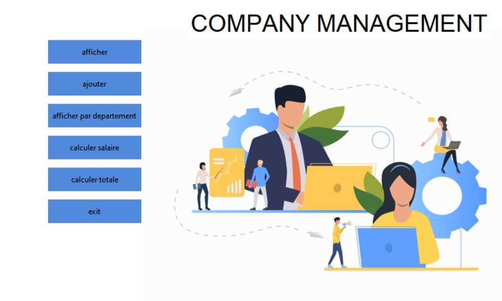

# 🏢 Company Management System – Tkinter GUI

A desktop-based employee and department management system developed using Python and Tkinter. This project is designed to simulate real-world HR operations, allowing users to manage employees, department heads (chefs), and calculate salaries based on working hours and prime bonuses.

---

## 📌 Features

- 👨‍💼 Create and manage employees and department chefs.
- 📊 Automatically calculate salaries based on working hours.
- 🎯 Prime-based bonus calculation for department heads.
- 🗃️ Save employee and chef data to CSV files.
- 🧠 Uses Object-Oriented Programming: Inheritance, Abstraction, and Class methods.
- 🖥️ Graphical User Interface built with `Tkinter`.
- 🧮 Age calculation based on birthdate.
- 🔍 Filter display by department.

---

## 📸 Screenshot

---
📦 Requirements
1-tkinter

2-pillow – for image/icon support

You can install them manually if needed:

--> pip install pillow

🧑‍💻 Author
Your Name

GitHub: @ayoub788jf